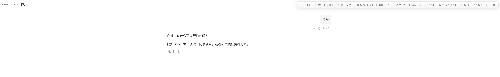

# Kimi Code Usage HUD

给 kimi-code 的 Web UI 加一条**会话用量状态条**：不用登录、不用调 Kimi 账号，只读本地 `~/.kimi-code/sessions`，把当前会话的 token、耗时、缓存、TTFT、TPS 折叠成一行，实时显示在页面右上角。

## 痛点

kimi-code 的 CLI 和 Web UI 都不会直接展示会话的「用量画像」：

- 一次对话花了多少 **input / output token**，说不清；
- **模型生成耗时、工具调用耗时、每轮平均耗时**需要自己翻日志心算；
- **缓存命中率、流式速度、解码 TPS、TTFT**这些对评估 prompt / 模型 / 成本很关键的指标，Web 界面里看不到。

相比之下 dsh 有一条专门的用量状态条。这个扩展就是把这个能力补到 kimi-code 上——**只在本地读文件，不上传、不碰你的账号**。

## 功能

状态条一行展示（三档可切）：

| 字段 | 含义 |
|---|---|
| `N 轮 · M 步` | 会话轮数、Agent step 数 |
| `LLM x.xs · 工具 x.s` | 模型生成墙钟、工具调用墙钟 |
| `首 token x.xs · yyy tok/s` | 客户端 TTFT 与流式速度 |
| `TTFT 客户端 x · 服务端 x` | 客户端 / 服务端首 token 延迟对比 |
| `均轮 x.s` | 每轮平均墙钟 |
| `缓存 82%` | 输入 token 缓存命中率 |
| `输入 142k · 输出 6.7k · TPS 126 tok/s` | 输入、输出、解码速度，两个 tok/s 分别是流式和解码吞吐 |

- 三档排版：`全量` → `只显示关键值` → `完全缩略`，点右侧按钮循环。
- 明暗主题切换（默认浅色，匹配 kimi 页面，点 `☾`/`☀` 切）。
- 跟随当前会话：你在 kimi 侧栏切到哪个会话，状态条自动 fold 哪个，无需手动选。

## 原理

- **只 fold 当前会话，不扫全部**：host 用 kimi 自维护的 `session_index.jsonl` 定位会话列表，默认只读 `mtime` 最新的会话；切换时按 `sessionId` 惰性 fold 目标会话。
- **Native Messaging host**：一个本地 Node 宿主（`host/host.mjs`），按 Chrome 的 stdio 分帧协议逐行折叠 `wire.jsonl`，避免浏览器沙箱对文件系统的限制；扩展声明 `nativeMessaging` 权限后，`service worker` 通过 `sendNativeMessage` 调用。
- 折叠语义对齐 `@deepseek-ai/dsh-session-stats`：`steps` 数 `step.end`，`turns` 按 turnId 去重，`llmMs` 累加首 token + 流式时长，`toolMs` 按 `tool.call → tool.result` 的 `toolCallId` 配对，`turn.ended` 丢弃未闭合的工具调用。

## 安装

1. 打开 `chrome://extensions`，开启**开发者模式**，点**加载已解压的扩展程序**，选择本目录。
2. 复制该扩展的 **ID**（在扩展卡片上能看到），执行：

   ```bash
   ./host/install.sh <扩展ID>
   ```

   脚本会解析出你本机的 `node` 绝对路径，生成 `host/host-launcher` 并写入 Native Messaging 注册文件。`host-launcher` 是**本机生成物（含本地绝对路径），不要提交**，已列入 `.gitignore`。

3. **彻底退出并重开 Chrome**（Quit，不是关窗口），让 Chrome 重新读取 Native Messaging host。
4. 打开 kimi 会话页（`http://127.0.0.1:<port>/sessions/<id>` 或 `http://localhost:<port>/sessions/<id>`），右上角即出现状态条。

## 使用

- 顶部状态条在 kimi 页面内可见；点 `⋮⋮` 可拖动位置。
- 点右侧按钮在 `全量 / 关键值 / 缩略` 三档间切换。
- 点 `☾`/`☀` 切深浅主题。

## 截图



## 隐私

- 只读 `~/.kimi-code/sessions/**`，**不**读取或上传其他文件。
- 不调用 Kimi 账号、不需 API key、无任何网络上报。
- Native Messaging host 只在浏览器发起请求时本地运行并返回这一条用量。

## 开发

```bash
npm test        # Node 内置 test runner
node --check src/*.js host/*.mjs   # 语法检查
```

项目结构：

```
src/          content script / service worker / 折叠解析
host/         Native Messaging host + 安装脚本
styles/       状态条样式（浅色/深色 + 三档）
popup/        目录授权的备用弹窗（Native host 失败时的 FSA 回退）
tests/        折叠语义单测
screenshots/  README 截图
```