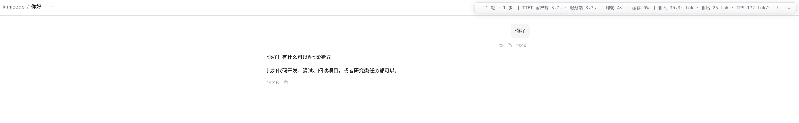

# Kimi Code Usage HUD

> 直接下载：[kimi-usage-hud-0.2.2.zip](https://github.com/LMFrank/kimi-usage-hud/releases/download/0.2.2/kimi-usage-hud-0.2.2.zip)（浏览器扩展） ｜ 桌面补丁：[kimi-usage-hud-desktop-0.2.2.zip](https://github.com/LMFrank/kimi-usage-hud/releases/download/0.2.2/kimi-usage-hud-desktop-0.2.2.zip)

给 kimi-code 的 Web UI 加一条**会话用量状态条**：不用登录、不用调 Kimi 账号，只读本地 `~/.kimi-code/sessions`，把当前会话的 token、耗时、缓存、TTFT、TPS 折叠成一行，实时显示在页面右上角。同一状态条也能装进 **Kimi Code 桌面客户端**（见「桌面客户端」一节），那一侧直接读客户端本地 API。

## 痛点

kimi-code 的 CLI 和 Web UI 都不会直接展示会话的「用量画像」：

- 一次对话花了多少 **input / output token**，说不清；
- **模型生成耗时、工具调用耗时、每轮平均耗时**需要自己翻日志心算；
- **缓存命中率、流式速度、解码 TPS、TTFT**这些对评估 prompt / 模型 / 成本很关键的指标，Web 界面里看不到。

相比之下 dsh 有一条专门的用量状态条。这个扩展就是把这个能力补到 kimi-code 上——**只在本地读文件，不上传、不碰你的账号**。

## 功能

状态条一行展示（三档可切）：

| 字段 | 含义 |
|---|---|
| `N 轮 · M 步` | 会话轮数、Agent step 数 |
| `LLM x.xs · 工具 x.s` | 模型生成墙钟、工具调用墙钟 |
| `首 token x.xs · yyy tok/s` | 客户端 TTFT 与流式速度 |
| `TTFT 客户端 x · 服务端 x` | 客户端 / 服务端首 token 延迟对比 |
| `均轮 x.s` | 每轮平均墙钟 |
| `缓存 82%` | 输入 token 缓存命中率 |
| `输入 142k · 输出 6.7k · TPS 126 tok/s` | 输入、输出、解码速度，两个 tok/s 分别是流式和解码吞吐 |

- 三档排版：`全量` → `只显示关键值` → `完全缩略`，点右侧按钮循环。
- 明暗主题切换（默认浅色，匹配 kimi 页面，点 `☾`/`☀` 切）。
- 跟随当前会话：你在 kimi 侧栏切到哪个会话，状态条自动 fold 哪个，无需手动选。

## 原理

- **只 fold 当前会话，不扫全部**：host 用 kimi 自维护的 `session_index.jsonl` 定位会话列表，默认只读 `mtime` 最新的会话；切换时按 `sessionId` 惰性 fold 目标会话。
- **Native Messaging host**：一个本地 Node 宿主（`host/host.mjs`），按 Chrome 的 stdio 分帧协议逐行折叠 `wire.jsonl`，避免浏览器沙箱对文件系统的限制；扩展声明 `nativeMessaging` 权限后，`service worker` 通过 `sendNativeMessage` 调用。
- 折叠语义对齐 `@deepseek-ai/dsh-session-stats`：`steps` 数 `step.end`，`turns` 按 turnId 去重，`llmMs` 累加首 token + 流式时长，`toolMs` 按 `tool.call → tool.result` 的 `toolCallId` 配对，`turn.ended` 丢弃未闭合的工具调用。

## 安装

1. 打开 `chrome://extensions`，开启**开发者模式**，点**加载已解压的扩展程序**，选择本目录。
2. 复制该扩展的 **ID**（在扩展卡片上能看到），执行：

   ```bash
   ./host/install.sh <扩展ID>
   ```

   脚本会生成 `host/host-launcher` 并写入 Native Messaging 注册文件。启动脚本按「nvm default → 安装时的 node → 其它 nvm 版本 → 系统 node」的顺序解析 Node，因此换 Node 版本（nvm 升级/切换）后不会失效；`host-launcher` 是**本机生成物（含本地绝对路径），不要提交**，已列入 `.gitignore`。

3. **彻底退出并重开 Chrome**（Quit，不是关窗口），让 Chrome 重新读取 Native Messaging host。
4. 打开 kimi 会话页（`http://127.0.0.1:<port>/sessions/<id>` 或 `http://localhost:<port>/sessions/<id>`），右上角即出现状态条。

## 使用

- 顶部状态条在 kimi 页面内可见；点 `⋮⋮` 可拖动位置。
- 点右侧按钮在 `全量 / 关键值 / 缩略` 三档间切换。
- 点 `☾`/`☀` 切深浅主题。

## 桌面客户端（Kimi Code 客户端内面板）

同一条状态条可以直接注入 Kimi Code 桌面客户端（Electron）的页面，不需要浏览器扩展、
不需要 Native Messaging host：数据改从**客户端自己的本地 REST API** 读取。

> 只装面板、不下载仓库：从 Releases 下载 `kimi-usage-hud-desktop-0.2.2.zip`，解压后在同一目录执行 `bash desktop/install.sh`（与仓库内安装方式一致）。

```bash
bash desktop/install.sh                                         # 安装/更新（幂等，可反复执行）
bash desktop/install.sh --uninstall                             # 完整卸载（逐字节还原 index.html）
bash desktop/install.sh --app "/Applications/Kimi Code.app"      # 指定客户端位置
```

安装后重载客户端（Cmd+R）或重启，进入任意会话页即出现状态条。

### 数据来源

- 页面地址 `/sessions/<sid>` 决定跟随哪个会话：切会话时先拉最新一页立即出数，
  再用 `before_turn` 逐页向更早补齐**整会话**（20 轮/页，main 最多 50 页、每个子
  agent 最多 20 页防呆），边补边更新；之后每 2s 重拉 main 最新一页（默认 2 轮），
  进行中的轮会被整轮覆盖更新，不会重复计数。
- 指标来自 `GET /api/v1/sessions/<sid>/transcript?agent_id=main`（客户端自己的会话视图
  用的就是这个接口）：transcript 的 item 是「轮」，每轮的 `steps[]` 直接带 `usage` 与
  `llmTiming`——字段与 wire.jsonl 的 `step.end` 逐项对齐，所以折算口径与扩展版一致。
- 子 agent 的 token 用**同一口径**：roster（响应里的 `agents`）里每个非 main agent
  各自分页拉 transcript 并折叠 `step.usage`；每 15s 再重拉各自最新一页覆盖更新。
  （1.1.1 起子 agent 的 `meta.agent.usage.total` 为 null，不再使用。）
- 请求都打向客户端自己的本地服务（同源，鉴权头由客户端自己注入），页面脚本不带任何凭据：
  不读账号、不读 localStorage 里的凭据、没有任何外部网络请求。
- 主题与显示档位记在页面 localStorage 的 `kuh.*` 键上；无会话、请求失败、无数据
  都会在状态条上给出明确文案（`无会话` / `读取失败(状态码)` / `无数据` / `N 轮 · 无耗时元数据`）。

### 口径差异（相对浏览器扩展读 wire.jsonl）

| 指标 | 桌面客户端口径 | 差异说明 |
|---|---|---|
| 轮 / 步 | transcript 的 turn / step：一步一条 `step`，`turnId` 去重即一轮 | 与 wire 的 distinct `turnId`、`step.end` 一致；transcript 只收录**产生过消息**的轮，wire 里没产出消息的轮不会出现在面板 |
| LLM 耗时 | Σ(客户端首 token + 流式时长) | 与 wire 一致 |
| 每轮耗时 | `turn.durationMs` | 与 wire 的 `turn.ended.durationMs` 同源；未结束的轮没有该字段，不计入均轮 |
| 服务端 TTFT | `step.llmTiming.llmServerFirstTokenMs` 的均值，且要求**样本覆盖率 ≥ 90%** | 1.1.1 的投影只带少量服务端计时样本（实测 3/176），直接平均会被异常大值带偏，因此覆盖率不足时显示 `–` |
| 解码 TPS | `llmServerDecodeMs` 聚合，样本覆盖率 ≥ 90%；否则退回流式口径 | 两者都是同一段流式窗口的耗时（`llmServerDecodeMs` / `llmStreamDurationMs`），样本充分时数值一致 |
| 工具耗时 | **不可得**：transcript 的 tool frame 只有 state/output，没有时间戳 | 状态条该字段显示 `–`；wire 侧是 `tool.call → tool.result` 事件时间。`/messages` 的 `created_at` 是消息开始时间（不是工具调用时刻），配对结果比 wire 大 2.3 倍，不可替代 |
| token | main 与各子 agent 都按 `step.usage` 逐步折叠后求和 | 与 wire 的 `usage.record` 同口径；面板包含**进行中的轮**已完成步骤，而 wire 的 `usage.record` 在轮结束才落盘，会话忙碌时面板会略大于 wire |
| 统计范围 | 整会话（main 50 页、每个子 agent 20 页上限） | 扩展版折叠整份 wire 文件 |
| 模型名 | `meta.agent.model` | 扩展版取 wire 的 `config.update` / `usage.record` |

### 注意

- 想核对面板数字：`node desktop/verify.mjs <sessionId>`（省略 id 取最近改动的会话）
  会按扩展版口径读 `~/.kimi-code/sessions/**/wire.jsonl`，打印同一行字段用于逐项对照。
  建议在会话**空闲**时对照：面板把进行中的轮也已完成的步骤算进去了，wire 的
  `usage.record` 要等轮结束才写。
- 客户端大版本更新会整体替换 `desktop-dist`，补丁随之消失（属预期）：重新执行
  `bash desktop/install.sh` 即可恢复。
- 卸载（`--uninstall`）用备份逐字节还原 `index.html`，并删除 `/kuh` 载荷目录。

## 截图



## 隐私

- 只读 `~/.kimi-code/sessions/**`，**不**读取或上传其他文件。
- 桌面客户端面板只请求客户端自己的本地服务（`/api/v1/sessions/<sid>/transcript`，
  以及子 agent 用量的同接口 `page_size=1` 请求），不读凭据、不发外部请求。
- 不调用 Kimi 账号、不需 API key、无任何网络上报。
- Native Messaging host 只在浏览器发起请求时本地运行并返回这一条用量。

## 开发

```bash
npm test        # Node 内置 test runner
npm run check   # desktop/ 四个入口文件的语法检查
node --check src/*.js host/*.mjs   # 语法检查
```

项目结构：

```
src/          content script / service worker / 折叠解析（口径来源，扩展与桌面端共用）
desktop/      桌面客户端补丁
  loader.js     注入进 index.html 的普通脚本：解析本地服务源、挂样式与模块、看门狗
  hud-app.js    会话页内运行的状态条：跟随路由、整会话分页补齐、轮询覆盖更新、子 agent 用量、渲染
  fold.js       把 transcript 的轮/步与各 agent 用量折叠成状态条指标（纯函数，可单测）
  install.mjs   安装器：备份/注入 index.html、同步 /kuh 载荷、--uninstall 逐字节还原
  install.sh    macOS 入口：借客户端自带 Node 运行 install.mjs
  verify.mjs    对照工具：按扩展（wire.jsonl）口径打印某个会话的同一行字段
  VERSION       补丁版本号
host/         Native Messaging host + 安装脚本
styles/       状态条样式（浅色/深色 + 三档，扩展与桌面端共用）
popup/        目录授权的备用弹窗（Native host 失败时的 FSA 回退）
tests/        折叠语义单测（wire 解析 + 桌面端消息折叠）
screenshots/  README 截图
```

## 版本历史

见 [CHANGELOG.md](CHANGELOG.md)。

## 许可证

本项目采用 [MIT License](LICENSE)。
